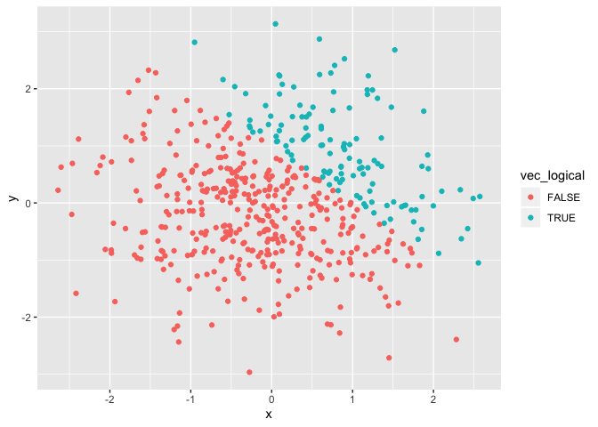
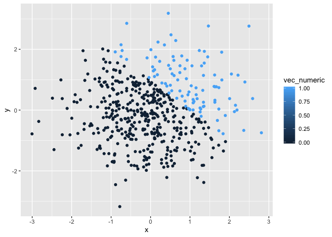
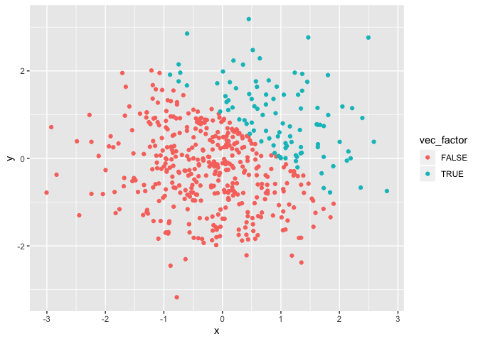

Homework 1
================
Stephen Powers
2019-09-10

## Problem 1

Create a data frame comprised of:

1)  a random sample of size 8 from a standard Normal distribution
2)  a logical vector indicating whether elements of the sample are
    greater than 0
3)  a character vector of length 8
4)  a factor vector of length 8, with 3 different factor
    “levels”

<!-- end list -->

``` r
library(tidyverse)
```

    ## ── Attaching packages ───────────────────────────────────────────────────── tidyverse 1.2.1 ──

    ## ✔ ggplot2 3.2.1     ✔ purrr   0.3.2
    ## ✔ tibble  2.1.3     ✔ dplyr   0.8.3
    ## ✔ tidyr   0.8.3     ✔ stringr 1.4.0
    ## ✔ readr   1.3.1     ✔ forcats 0.4.0

    ## ── Conflicts ──────────────────────────────────────────────────────── tidyverse_conflicts() ──
    ## ✖ dplyr::filter() masks stats::filter()
    ## ✖ dplyr::lag()    masks stats::lag()

``` r
first_df = tibble(
  vec_rsamp = rnorm(8),
  vec_logical = vec_rsamp > 0,
  vec_char = c("a","b","c","d","e","f","g","h"),
  vec_factor = factor(c("i","j","k","i","j","k","i","j"))
)
```

### Calculate Means

``` r
mean(pull(first_df, vec_rsamp))
```

    ## [1] -0.287619

``` r
mean(pull(first_df, vec_logical))
```

    ## [1] 0.375

``` r
mean(pull(first_df, vec_char))
```

    ## Warning in mean.default(pull(first_df, vec_char)): argument is not numeric
    ## or logical: returning NA

    ## [1] NA

``` r
mean(pull(first_df, vec_factor))
```

    ## Warning in mean.default(pull(first_df, vec_factor)): argument is not
    ## numeric or logical: returning NA

    ## [1] NA

We were able to get the means for vec\_rsamp and vec\_logical because
they are numeric. We were unable to get the mean for vec\_char and
vec\_factor because they are not numeric or logical values.

### Converting Variables

``` r
as.numeric(pull(first_df, vec_logical))
```

    ## [1] 0 0 0 1 0 1 1 0

This code converts the logical vectors values “TRUE” and “FALSE” into 1
and 0. This occurs because in R language TRUE = 1 and FALSE = 0.

``` r
as.numeric(pull(first_df, vec_char)) 
```

    ## Warning: NAs introduced by coercion

    ## [1] NA NA NA NA NA NA NA NA

This introduces NAs in place of characters by coercion because character
vectors are unable to be coerced into numerical vectors.

``` r
as.numeric(pull(first_df, vec_factor))
```

    ## [1] 1 2 3 1 2 3 1 2

Each factor level was assigned a different numeric value for the factor
values.

Yes, this helps explain what happens when you try to take the mean
because it shows what can be converted into numeric and what cannot.

### Creating Second Code Chunk

1)  Convert the logical vector to numeric, and multiply the random
    sample by the
    result

<!-- end list -->

``` r
as.numeric(pull(first_df, vec_logical)) * pull(first_df,vec_rsamp) 
```

    ## [1] 0.0000000 0.0000000 0.0000000 1.0885642 0.0000000 0.2063789 0.1183314
    ## [8] 0.0000000

2)  Convert the logical vector to a factor, and multiply the random
    sample by the result

<!-- end list -->

``` r
as.factor(pull(first_df, vec_logical)) * pull(first_df,vec_rsamp) 
```

    ## Warning in Ops.factor(as.factor(pull(first_df, vec_logical)),
    ## pull(first_df, : '*' not meaningful for factors

    ## [1] NA NA NA NA NA NA NA NA

3)  Convert the logical vector to a factor and then convert the result
    to numeric, and multiply the random sample by the
result

<!-- end list -->

``` r
as.numeric(as.factor(pull(first_df, vec_logical))) * pull(first_df,vec_rsamp) 
```

    ## [1] -0.6478086 -1.1266245 -0.5628219  2.1771284 -1.2707242  0.4127578
    ## [7]  0.2366628 -0.1062476

## Problem 2

Create a data frame comprised of: (1) x: a random sample of size 500
from a standard Normal distribution (2) y: a random sample of size 500
from a standard Normal distribution (3) A logical vector indicating
whether x + y \> 1 (4) A numeric vector created by coercing the above
logical vector (5) A factor vector created by coercing the above logical
vector

``` r
second_df = tibble(
  x = rnorm(500),
  y = rnorm(500),
  vec_logical = x + y > 1,
  vec_numeric = as.numeric(vec_logical),
  vec_factor = as.factor(vec_logical),
)
```

### Inline Code

This data frame has ‘nrow(second\_df)’ rows and ‘ncol(second\_df)’
columns.The mean, median, and standard deviation of the ‘x’ variable is
‘mean(pull(second\_df, x))’, median(pull(second\_df, x)), and
sd(pull(second\_df, x)).

### Scatter Plots

1)  Logical Scatter Plot

<!-- end list -->

``` r
ggplot(second_df, aes(x = x, y = y, color = vec_logical)) + geom_point()
```

<!-- -->

``` r
ggsave("scatter_plotHW1.pdf")
```

    ## Saving 7 x 5 in image

2)  Numeric Scatter Plot

<!-- end list -->

``` r
ggplot(second_df, aes(x = x, y = y, color = vec_numeric)) + geom_point()
```

<!-- -->

3)  Factor Scatter Plot

<!-- end list -->

``` r
ggplot(second_df, aes(x = x, y = y, color = vec_factor)) + geom_point()
```

<!-- -->

All three of the scatter plots look very similar. However, the logical
and factor scale both use “TRUE” or “FALSE”, but the numeric scale is 0
or 1.
