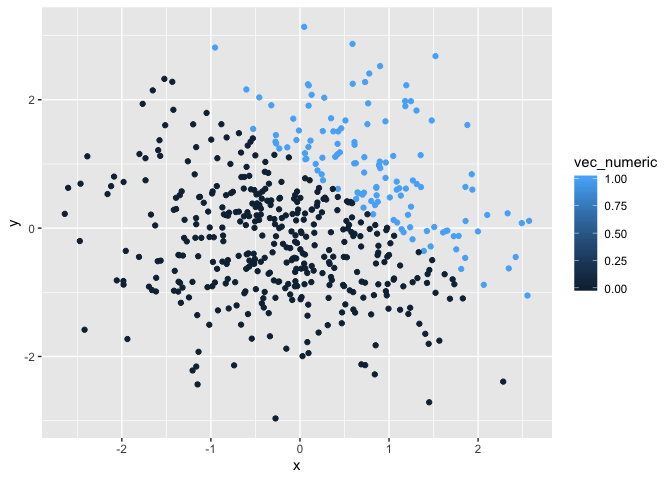

Homework 1
================
Stephen Powers
2019-09-10

## Problem 1

Create a data frame comprised of:

1)  a random sample of size 8 from a standard Normal distribution
2)  a logical vector indicating whether elements of the sample are
    greater than 0
3)  a character vector of length 8
4)  a factor vector of length 8, with 3 different factor
    “levels”

### Calculate Means

``` r
mean(first_df[["vec_rsamp"]])
```

    ## [1] 0.4758378

``` r
mean(first_df[["vec_logical"]])
```

    ## [1] 0.5

``` r
mean(first_df[["vec_char"]])
```

    ## Warning in mean.default(first_df[["vec_char"]]): argument is not numeric or
    ## logical: returning NA

    ## [1] NA

``` r
mean(first_df[["vec_factor"]])
```

    ## Warning in mean.default(first_df[["vec_factor"]]): argument is not numeric
    ## or logical: returning NA

    ## [1] NA

We were able to get the means for vec\_rsamp and vec\_logical because
they are numeric. We were unable to get the mean for vec\_char and
vec\_factor because they are not numeric values.

``` r
nvec_logical = as.numeric(first_df[["vec_logical"]])
```

Not sure what this does yet.

``` r
nvec_char = as.numeric(first_df[["vec_char"]])
```

    ## Warning: NAs introduced by coercion

This introduces NAs in place of characters by coercion.

``` r
nvec_factor = as.numeric(first_df[["vec_factor"]])
```

    ## Warning: NAs introduced by coercion

This introduces NAs in place of factorial values by coercion.

1)  Convert the logical vector to numeric, and multiply the random
    sample by the
result

<!-- end list -->

``` r
nvec_factor = as.numeric(first_df[["vec_factor"]]) * pull(first_df,vec_rsamp) 
```

    ## Warning: NAs introduced by coercion

2)  Convert the logical vector to a factor, and multiply the random
    sample by the
result

<!-- end list -->

``` r
nvec_factor = as.factor(first_df[["vec_factor"]])*pull(first_df,vec_rsamp)
```

    ## Warning in Ops.factor(as.factor(first_df[["vec_factor"]]), pull(first_df, :
    ## '*' not meaningful for factors

3)  Convert the logical vector to a factor and then convert the result
    to numeric, and multiply the random sample by the result

## Problem 2

Create a data frame comprised of: (1) x: a random sample of size 500
from a standard Normal distribution (2) y: a random sample of size 500
from a standard Normal distribution (3) A logical vector indicating
whether x + y \> 1 (4) A numeric vector created by coercing the above
logical vector (5) A factor vector created by coercing the above logical
vector

``` r
second_df = tibble(
  x = rnorm(500),
  y = rnorm(500),
  vec_logical = x + y > 1,
  vec_numeric = as.numeric(vec_logical),
  vec_factor = as.factor(vec_logical),
)
```

### Inline Code

This data frame has ‘nrow(second\_df)’ rows and ‘ncol(second\_df)’
columns.The mean, median, and standard deviation of the ‘x’ variable is
‘mean(pull(second\_df, x))’, median(pull(second\_df, x)), and
sd(pull(second\_df, x)).

### Scatter Plots

1)  Logical Scatter Plot

<!-- end list -->

``` r
ggplot(second_df, aes(x = x, y = y, color = vec_logical)) + geom_point()
```

<!-- -->

``` r
ggsave("scatter_plotHW1.pdf")
```

    ## Saving 7 x 5 in image

2)  Numeric Scatter Plot

<!-- end list -->

``` r
ggplot(second_df, aes(x = x, y = y, color = vec_numeric)) + geom_point()
```

<!-- -->

3)  Factor Scatter Plot

<!-- end list -->

``` r
ggplot(second_df, aes(x = x, y = y, color = vec_factor)) + geom_point()
```

<!-- -->

All three of the scatter plots look very similar. Logical and factor
both use “true” or “false”, but numeric is 0 or 1.
